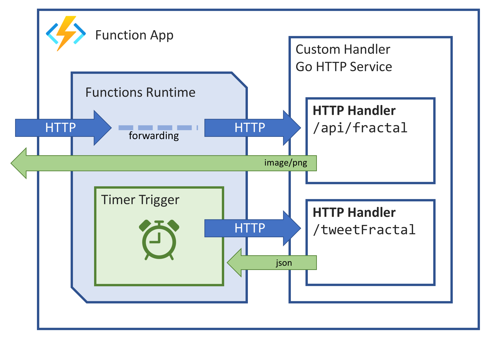

# Serverless Fractal Bot

This is a simple example of a Azure Function using a custom handler written in Go. It generates images of Mandlebrot and Julia set fractals, and sends them to Twitter.

It leverages the modules & packages exported from another project https://github.com/benc-uk/gofract in order to generate the fractal images.

You can read more about [Azure Function custom handlers here](https://learn.microsoft.com/en-us/azure/azure-functions/functions-custom-handlers)

## Functions

The app consists of just two functions

### `fractal` 

This is a HTTP trigger based function, with `enableForwardingHttpRequest` set to true (see hosts.json) this means requests are passed through directly to the function. This is so the function can return the generated PNG image to the user via their browser. Note. The route mapping is `/api/fractal` which corresponds 1:1 with the URL exposed by the Azure Functions App

All parameters for the generation of the fractal are passed in via the URL query string

### `tweetFractal`

This is a timer trigger based function. The Functions runtime POSTS a HTTP request to the handler. [The payload is described here](https://learn.microsoft.com/en-us/azure/azure-functions/functions-custom-handlers#request-payload) but the handler doesn't require anything from the payload so it's not read.

The handler carries out the following each time it is invoked:

- Generates parameters for "good" random fractal
- Renders it to a PNG image buffer
- Uploads the image to twitter 
- Sends a tweet with the image attached
- Send [a JSON HTTP response back](https://learn.microsoft.com/en-us/azure/azure-functions/functions-custom-handlers#response-payload) to the functions runtime, indicating success & completion

The code to interact with the Twitter API is in `pkg/twitter` and leverages the https://github.com/dghubble/oauth1 library to sign the API requests. The required app settings (like secrets, keys etc) to send tweets can be found in `local.settings.json.sample`